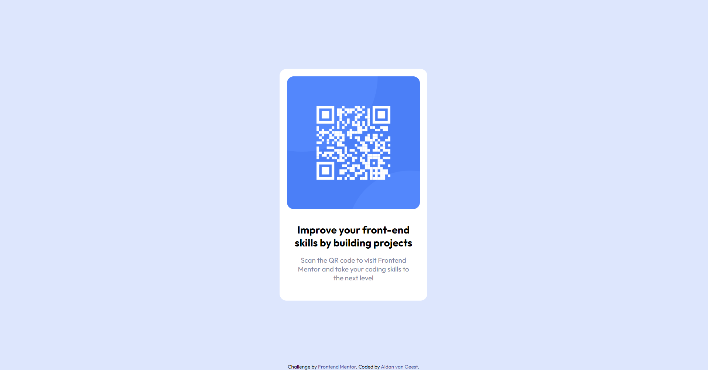

# Frontend Mentor - QR code component solution

This is a solution to the [QR code component challenge on Frontend Mentor](https://www.frontendmentor.io/challenges/qr-code-component-iux_sIO_H). Frontend Mentor challenges help you improve your coding skills by building realistic projects.

## Table of contents

- [Frontend Mentor - QR code component solution](#frontend-mentor---qr-code-component-solution)
  - [Table of contents](#table-of-contents)
  - [Overview](#overview)
    - [Screenshots](#screenshots)
      - [Mobile](#mobile)
      - [Desktop](#desktop)
    - [Links](#links)
  - [My process](#my-process)
    - [Built with](#built-with)
    - [What I learned](#what-i-learned)
    - [Continued development](#continued-development)
    - [Useful resources](#useful-resources)
  - [Author](#author)

## Overview

### Screenshots

#### Mobile


#### Desktop



### Links

- Solution URL: [https://github.com/AidanvG/qr-code-component](https://github.com/AidanvG/qr-code-component)
- Live Site URL: [https://aidanvg.github.io/qr-code-component/](https://aidanvg.github.io/qr-code-component/)

## My process

### Built with

- HTML
- CSS
- Mobile-first workflow

### What I learned

I learnt a lot while completing my first Frontend Mentor project. 

Most of my time went into learning how to position elements on the webpage, specifically trying to place the card div in the center of the screen (horizontally and vertically) and the attibution div at the bottom of the screen (centered horizontally).

```css
.card {
    position: absolute;
    top: 50%;
    left: 50%;
    transform: translate(-50%, -50%);
}

.attribution { 
    text-align: center; 
    position: absolute;
    bottom: 0;
    left: 50%;
    transform: translate(-50%, 0);
    width: 100%;
}
```

I also learnt about using width and margins to align child elements nicely within a parent element.

```css
.card img {
    width: 90%;
    height: auto;
    margin: 5%;
}

.main-text {
    margin: 10px 20px 40px;
}

h2 {
    margin-top: 0;
    margin-bottom: 15px;
}

p {
    margin: 0 10px;
}
```

### Continued development

I would like to work on the following going forward with future projects:

- Refining my development approach during planning
- Using transform and the translate function
- Learn how to use Grid and Flexbox for the layout of a webpage

### Useful resources

- [Centering a div](https://blog.hubspot.com/website/center-div-css) - This helped me to place the card div in the center of the screen (specifically the third method).

## Author

- Frontend Mentor - [@AidanvG](https://www.frontendmentor.io/profile/AidanvG)
- Github - [AidanvG](https://github.com/AidanvG)
